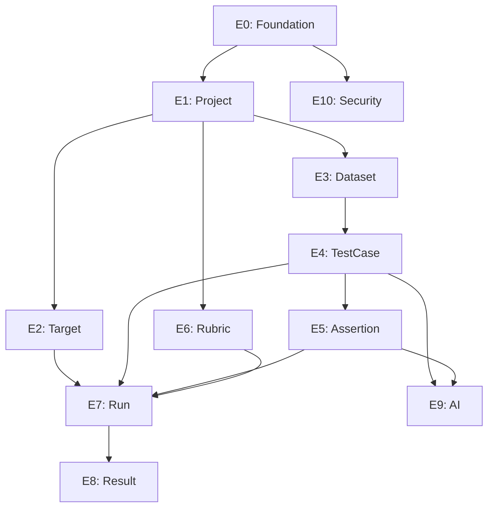

# Task Breakdown: Backend (`apps/api/`)

> **Tham chiếu:** PRD.md, LLD_FullStack.md, Database_Design.md, API_Design.md
>
> **Quy tắc Gate-Check:** Mỗi task con khi hoàn thành phải được review. Chỉ được tiếp tục task tiếp theo khi review **KHÔNG phải `FALSE`**.

## Chú thích

| Ký hiệu | Ý nghĩa |
|----------|---------|
| ⬜ | Chưa làm |
| 🔄 | Đang làm |
| ✅ | Đã xong, chờ review |
| Review: `DONE` | ✅ Approved, tiếp tục |
| Review: `WARNING` | ⚠️ Có vấn đề nhỏ, được phép tiếp tục nhưng phải fix sau |
| Review: `FALSE` | 🚫 Blocked — KHÔNG được code tiếp cho tới khi fix xong |

## Verification Commands (chạy sau MỖI task con)

```bash
# Build check (bắt buộc)
mvn compile -pl apps/api

# Test check (bắt buộc)
mvn test -pl apps/api

# Lint/Format check (khuyến nghị)
mvn checkstyle:check -pl apps/api
```

> ⚠️ Theo skill `incremental-implementation`: Chỉ chạy lại khi code đã thay đổi. Không chạy lại cùng lệnh trên code chưa sửa.

## Scope Sizing

| Size | Files | Ý nghĩa |
|------|-------|---------|
| **S** | 1-2 | Entity + Migration hoặc Service đơn giản |
| **M** | 3-5 | CRUD hoàn chỉnh 1 module (Entity + Service + Controller) |
| **L** | 5-8 | Logic phức tạp (ImportService, RunSnapshot assembly) |

---

## Task Tree tổng quan

```
apps/api/
├── E0: Foundation & Infrastructure
│   ├── E0.1: Project scaffold + dependencies
│   ├── E0.2: Global config (Exception, Validation, CORS)
│   ├── E0.3: Database connection + migration tool
│   └── E0.4: Redis Streams connection
│
├── E1: Project Module
│   ├── E1.1: Entity + DTO + Mapper
│   ├── E1.2: Repository + Service
│   └── E1.3: Controller + Tests
│
├── E2: Target & ResponseMapping Module
│   ├── E2.1: Entity + DTO + Mapper
│   ├── E2.2: cURL Parser Service
│   ├── E2.3: TargetService + ResponseMappingService
│   └── E2.4: Controller + Tests
│
├── E3: Dataset Module
│   ├── E3.1: Entity + DTO + Mapper
│   ├── E3.2: Service + Controller
│   └── E3.3: Tests
│
├── E4: TestCase Module
│   ├── E4.1: Entity + DTO + Mapper
│   ├── E4.2: TestCaseService (CRUD)
│   ├── E4.3: ImportService (CSV/Excel — Strategy Pattern)
│   └── E4.4: Controller + Tests
│
├── E5: Assertion & ToolExpectation Module
│   ├── E5.1: Assertion Entity + DTO + Mapper
│   ├── E5.2: ToolExpectation Entity + DTO + Mapper
│   ├── E5.3: Services
│   └── E5.4: Controller + Tests
│
├── E6: Rubric Module
│   ├── E6.1: Entity + DTO + Mapper
│   ├── E6.2: Service + Controller
│   └── E6.3: Tests
│
├── E7: Run Module (Complex — Facade Pattern)
│   ├── E7.1: Run Entity + DTO
│   ├── E7.2: RunSnapshot assembly (Batch Fetching — 5 SQL)
│   ├── E7.3: Redis Streams publisher (XADD)
│   ├── E7.4: RunService (Facade)
│   └── E7.5: Controller + Tests
│
├── E8: Result & ManualReview Module
│   ├── E8.1: TestResult + AssertionResult + ToolExpectationResult Entities
│   ├── E8.2: Result ingestion API (POST from Runner)
│   ├── E8.3: ManualReview Entity + Service
│   ├── E8.4: Report aggregation Service
│   └── E8.5: Controller + Tests
│
├── E9: AI Integration Module
│   ├── E9.1: AIGeneratorService (Testcase generation)
│   ├── E9.2: AI Assertion suggestion
│   └── E9.3: Tests (WireMock)
│
└── E10: Security Module
    ├── E10.1: JWT Filter + AuthConfig
    ├── E10.2: SSRF Protection (InetAddressFilter)
    └── E10.3: SecurityFilterTest (MockMvc)
```

---

## Epics Details

* [E0: Foundation & Infrastructure](./backend_epics/E0_Foundation.md)
* [E1: Project Module](./backend_epics/E1_Project.md)
* [E2: Target & ResponseMapping Module](./backend_epics/E2_Target_ResponseMapping.md)
* [E3: Dataset Module](./backend_epics/E3_Dataset.md)
* [E4: TestCase Module](./backend_epics/E4_TestCase.md)
* [E5: Assertion & ToolExpectation Module](./backend_epics/E5_Assertion_ToolExpectation.md)
* [E6: Rubric Module](./backend_epics/E6_Rubric.md)
* [E7: Run Module](./backend_epics/E7_Run.md)
* [E8: Result & ManualReview Module](./backend_epics/E8_Result_ManualReview.md)
* [E9: AI Integration Module](./backend_epics/E9_AI_Integration.md)
* [E10: Security Module](./backend_epics/E10_Security.md)

---

## Dependency Graph



---

## Risks & Open Questions

| # | Risk / Câu hỏi | Impact | Giảm thiểu |
|---|---------------|--------|----------|
| 1 | **Flyway vs Liquibase**: Chưa chốt dùng migration tool nào. Cần quyết định trước E0.3. | Medium | Team chọn và viết ADR nếu cần. |
| 2 | **JWT Provider**: Chưa rõ dùng Keycloak, Auth0 hay tự code JWT. Ảnh hưởng E10. | High | Chốt trước khi làm E10. |
| 3 | **AI LLM Provider**: Chưa rõ dùng OpenAI, Gemini hay Azure. Ảnh hưởng E9. | Medium | Abstract qua interface, chọn provider sau. |
| 4 | **Large CSV Import**: File CSV > 100k dòng có thể timeout HTTP request. | Medium | Chuyển sang async import (background job) nếu cần. |
| 5 | **Redis Streams message size**: RunSnapshot chứa 10k testcases có thể vượt giới hạn message size. | High | Chunk RunSnapshot thành nhiều message nhỏ hoặc lưu snapshot vào DB rồi chỉ gửi ID qua Redis. |
