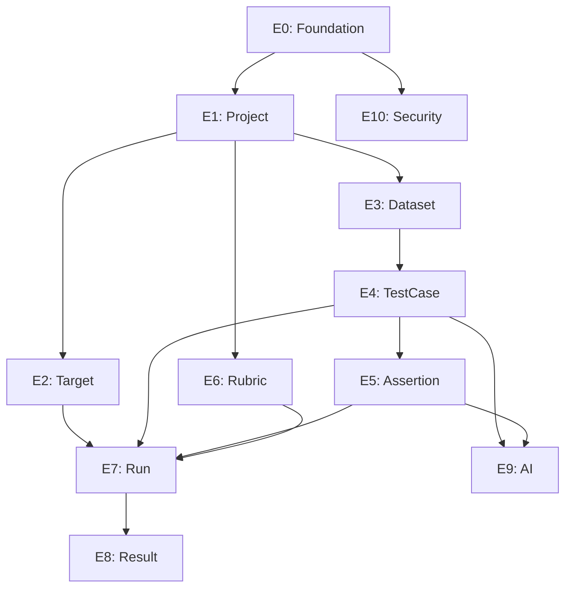

# Task Breakdown: Backend (`apps/api/`)

> **Tham chiếu:** PRD.md, LLD_FullStack.md, Database_Design.md, API_Design.md
>
> **Quy tắc Gate-Check:** Mỗi task con khi hoàn thành phải được review. Chỉ được tiếp tục task tiếp theo khi review **KHÔNG phải `FALSE`**.

## Chú thích

| Ký hiệu | Ý nghĩa |
|----------|---------|
| ⬜ | Chưa làm |
| 🔄 | Đang làm |
| ✅ | Đã xong, chờ review |
| Review: `DONE` | ✅ Approved, tiếp tục |
| Review: `WARNING` | ⚠️ Có vấn đề nhỏ, được phép tiếp tục nhưng phải fix sau |
| Review: `FALSE` | 🚫 Blocked — KHÔNG được code tiếp cho tới khi fix xong |

## Verification Commands (chạy sau MỖI task con)

```bash
# Build check (bắt buộc)
mvn compile -pl apps/api

# Test check (bắt buộc)
mvn test -pl apps/api

# Lint/Format check (khuyến nghị)
mvn checkstyle:check -pl apps/api
```

> ⚠️ Theo skill `incremental-implementation`: Chỉ chạy lại khi code đã thay đổi. Không chạy lại cùng lệnh trên code chưa sửa.

## Scope Sizing

| Size | Files | Ý nghĩa |
|------|-------|---------|
| **S** | 1-2 | Entity + Migration hoặc Service đơn giản |
| **M** | 3-5 | CRUD hoàn chỉnh 1 module (Entity + Service + Controller) |
| **L** | 5-8 | Logic phức tạp (ImportService, RunSnapshot assembly) |

---

## Task Tree tổng quan

```
apps/api/
├── E0: Foundation & Infrastructure
│   ├── E0.1: Project scaffold + dependencies
│   ├── E0.2: Global config (Exception, Validation, CORS)
│   ├── E0.3: Database connection + migration tool
│   └── E0.4: Redis Streams connection
│
├── E1: Project Module
│   ├── E1.1: Entity + DTO + Mapper
│   ├── E1.2: Repository + Service
│   └── E1.3: Controller + Tests
│
├── E2: Target & ResponseMapping Module
│   ├── E2.1: Entity + DTO + Mapper
│   ├── E2.2: cURL Parser Service
│   ├── E2.3: TargetService + ResponseMappingService
│   └── E2.4: Controller + Tests
│
├── E3: Dataset Module
│   ├── E3.1: Entity + DTO + Mapper
│   ├── E3.2: Service + Controller
│   └── E3.3: Tests
│
├── E4: TestCase Module
│   ├── E4.1: Entity + DTO + Mapper
│   ├── E4.2: TestCaseService (CRUD)
│   ├── E4.3: ImportService (CSV/Excel — Strategy Pattern)
│   └── E4.4: Controller + Tests
│
├── E5: Assertion & ToolExpectation Module
│   ├── E5.1: Assertion Entity + DTO + Mapper
│   ├── E5.2: ToolExpectation Entity + DTO + Mapper
│   ├── E5.3: Services
│   └── E5.4: Controller + Tests
│
├── E6: Rubric Module
│   ├── E6.1: Entity + DTO + Mapper
│   ├── E6.2: Service + Controller
│   └── E6.3: Tests
│
├── E7: Run Module (Complex — Facade Pattern)
│   ├── E7.1: Run Entity + DTO
│   ├── E7.2: RunSnapshot assembly (Batch Fetching — 5 SQL)
│   ├── E7.3: Redis Streams publisher (XADD)
│   ├── E7.4: RunService (Facade)
│   └── E7.5: Controller + Tests
│
├── E8: Result & ManualReview Module
│   ├── E8.1: TestResult + AssertionResult + ToolExpectationResult Entities
│   ├── E8.2: Result ingestion API (POST from Runner)
│   ├── E8.3: ManualReview Entity + Service
│   ├── E8.4: Report aggregation Service
│   └── E8.5: Controller + Tests
│
├── E9: AI Integration Module
│   ├── E9.1: AIGeneratorService (Testcase generation)
│   ├── E9.2: AI Assertion suggestion
│   └── E9.3: Tests (WireMock)
│
└── E10: Security Module
    ├── E10.1: JWT Filter + AuthConfig
    ├── E10.2: SSRF Protection (InetAddressFilter)
    └── E10.3: SecurityFilterTest (MockMvc)
```

---

## E0: Foundation & Infrastructure

> Nền tảng dự án. Tất cả các Epic khác phụ thuộc vào Epic này.

### E0.1: Project scaffold + dependencies

| # | Checklist | Status |
|---|-----------|--------|
| 1 | Khởi tạo Spring Boot 4.1.0 project từ template của team | ✅ |
| 2 | Thêm dependencies: Lombok, MapStruct, Spring Data JPA, Spring Data Redis, Validation, Web | ✅ |
| 3 | Cấu hình `application.yml` (datasource, redis, server port) | ✅ |
| 4 | Cấu hình Lombok annotation processor + MapStruct trong build tool | ✅ |
| 5 | Verify: `mvn compile` hoặc `gradle build` thành công, không lỗi | ✅ |

- **Commit:** `chore(api): init spring boot project with core dependencies`
- **Scope:** S
- **Review:** `DONE` | **Note:** Đã được khởi tạo sẵn trong codebase.

---

### E0.2: Global config (Exception, Validation, CORS)

| # | Checklist | Status |
|---|-----------|--------|
| 1 | Tạo `GlobalExceptionHandler` (`@ControllerAdvice`) trả JSON chuẩn `{error, message, timestamp}` | ✅ |
| 2 | Tạo custom exception classes: `ResourceNotFoundException`, `BusinessException` | ✅ |
| 3 | Cấu hình CORS cho phép `localhost:5173` (Vite dev server) | ✅ |
| 4 | Cấu hình `MessageSource` cho validation messages (nếu cần i18n) | ✅ |
| 5 | Test: Gọi API không tồn tại → trả đúng format JSON lỗi | ✅ |

- **Commit:** `feat(api): add global exception handler and CORS config`
- **Scope:** S
- **Review:** `DONE` | **Note:** Đã được code sẵn (xem package exception, config).

---

### E0.3: Database connection + migration tool

| # | Checklist | Status |
|---|-----------|--------|
| 1 | Cấu hình `application.yml` kết nối PostgreSQL từ `docker-compose.yml` | ✅ |
| 2 | Chọn và cài migration tool (Flyway hoặc Liquibase) | ✅ |
| 3 | Tạo migration script V1 (schema ban đầu — có thể rỗng hoặc chứa bảng `projects`) | ✅ |
| 4 | Verify: App khởi động thành công, migration chạy đúng, bảng được tạo | ✅ |

- **Commit:** `feat(api): configure postgresql and flyway migration`
- **Scope:** S
- **Review:** `DONE` | **Note:** Đã cấu hình Flyway, V1__init_schema.sql (Auth) đã tồn tại.

---

### E0.4: Redis Streams connection

| # | Checklist | Status |
|---|-----------|--------|
| 1 | Cấu hình `spring-data-redis` kết nối Redis từ `docker-compose.yml` | ✅ |
| 2 | Tạo `RedisStreamConfig` bean (StringRedisTemplate, StreamOperations) | ✅ |
| 3 | Viết hàm util `publishToStream(streamKey, payload)` dùng `XADD` | ✅ |
| 4 | Test: Gọi hàm publish, kiểm tra message xuất hiện trong Redis | ✅ |

- **Commit:** `feat(api): configure redis streams connection and publisher util`
- **Scope:** S
- **Review:** ✅ | **Note:**

---

### 🚩 Checkpoint: Phase 1 (Foundation)

| # | Kiểm tra | Status |
|---|----------|--------|
| 1 | `mvn compile` thành công, không lỗi | ✅ |
| 2 | `mvn test` pass (nếu có test) | ✅ |
| 3 | App khởi động được, kết nối PostgreSQL + Redis thành công | ✅ |
| 4 | Review với team trước khi tiếp tục | ✅ |

---

## E1: Project Module

> Dependency: E0 (Foundation)

### E1.1: Entity + DTO + Mapper

| # | Checklist | Status |
|---|-----------|--------|
| 1 | Tạo `Project` entity với Lombok (`@Entity`, `@Data`, `@Builder`) theo Database_Design | ✅ |
| 2 | Tạo `ProjectRequest` DTO (với `@Valid` annotations) | ✅ |
| 3 | Tạo `ProjectResponse` DTO | ✅ |
| 4 | Tạo `ProjectMapper` interface (MapStruct) | ✅ |
| 5 | Tạo Flyway migration cho bảng `projects` | ✅ |

- **Commit:** `feat(project): add entity, dto, mapper and migration`
- **Scope:** M
- **Review:** ✅ | **Note:**

---

### E1.2: Repository + Service

| # | Checklist | Status |
|---|-----------|--------|
| 1 | Tạo `ProjectRepository` (Spring Data JPA interface) | ✅ |
| 2 | Tạo `ProjectService` với CRUD: create, findById, findAll, update, archive | ✅ |
| 3 | Xử lý `ResourceNotFoundException` khi findById không tìm thấy | ✅ |
| 4 | Unit test `ProjectService` bằng Mockito (mock Repository) | ✅ |

- **Commit:** `feat(project): add repository, service and unit tests`
- **Scope:** M
- **Review:** ✅ | **Note:**

---

### E1.3: Controller + Integration Tests

| # | Checklist | Status |
|---|-----------|--------|
| 1 | Tạo `ProjectController` (`@RestController`, `/api/projects`) | ✅ |
| 2 | Implement endpoints: POST, GET /{id}, GET (list), PUT /{id}, PATCH /{id}/archive | ✅ |
| 3 | MockMvc integration test: Tạo project → 201 Created | ✅ |
| 4 | MockMvc integration test: Get project không tồn tại → 404 | ✅ |
| 5 | MockMvc integration test: Validation lỗi (thiếu name) → 400 | ✅ |

- **Commit:** `feat(project): add controller and integration tests`
- **Scope:** M
- **Review:** ✅ | **Note:**

---

### 🚩 Checkpoint: Phase 2 (CRUD cơ bản)

| # | Kiểm tra | Status |
|---|----------|--------|
| 1 | `mvn test` — All tests pass | ⬜ |
| 2 | API Project CRUD hoạt động đúng qua Postman/curl | ⬜ |
| 3 | Flyway migration chạy đúng, schema được tạo | ⬜ |

---

## E2: Target & ResponseMapping Module

> Dependency: E1 (Project phải tồn tại trước khi tạo Target)

### E2.1: Entity + DTO + Mapper

| # | Checklist | Status |
|---|-----------|--------|
| 1 | Tạo `Target` entity (FK tới Project) theo Database_Design (Hỗ trợ cả HTTP và LLM config) | ⬜ |
| 2 | Tạo `ResponseMapping` entity (FK tới Target, 1-1) | ⬜ |
| 3 | Tạo DTO: `TargetRequest`, `TargetResponse`, `ResponseMappingRequest`, `ResponseMappingResponse` | ⬜ |
| 4 | Tạo `TargetMapper`, `ResponseMappingMapper` (MapStruct) | ⬜ |
| 5 | Tạo Flyway migration cho bảng `targets` và `response_mappings` | ⬜ |

- **Commit:** `feat(target): add target and response mapping entities, dto, mapper`
- **Review:** ⬜ | **Note:**

---

### E2.2: cURL Parser Service

| # | Checklist | Status |
|---|-----------|--------|
| 1 | Tạo `CurlParserService` nhận chuỗi cURL string | ⬜ |
| 2 | Parse ra: method, url, headers, body | ⬜ |
| 3 | Sinh `bodyTemplate` với placeholder `{{input}}` | ⬜ |
| 4 | Unit test: Parse cURL POST có JSON body → đúng method, url, headers | ⬜ |
| 5 | Unit test: Parse cURL GET có query params → đúng url + query | ⬜ |
| 6 | Unit test: cURL không hợp lệ → throw BusinessException | ⬜ |

- **Commit:** `feat(target): add curl parser service with unit tests`
- **Review:** ⬜ | **Note:**

---

### E2.3: TargetService + ResponseMappingService

| # | Checklist | Status |
|---|-----------|--------|
| 1 | Tạo `TargetService` CRUD (liên kết ProjectId) | ⬜ |
| 2 | Tạo `ResponseMappingService` CRUD (liên kết TargetId) | ⬜ |
| 3 | Logic: Khi tạo Target từ cURL, tự động gọi `CurlParserService` | ⬜ |
| 4 | Unit test cho cả 2 service bằng Mockito | ⬜ |

- **Commit:** `feat(target): add target and response mapping services`
- **Review:** ⬜ | **Note:**

---

### E2.4: Controller + Tests

| # | Checklist | Status |
|---|-----------|--------|
| 1 | Tạo `TargetController` (`/api/projects/{projectId}/targets`) | ⬜ |
| 2 | Endpoint đặc biệt: `POST /parse-curl` nhận raw cURL → trả Target preview | ⬜ |
| 3 | Tạo `ResponseMappingController` (`/api/targets/{targetId}/response-mapping`) | ⬜ |
| 4 | MockMvc test: Tạo target từ cURL → 201 | ⬜ |
| 5 | MockMvc test: Cập nhật ResponseMapping → 200 | ⬜ |

- **Commit:** `feat(target): add controllers and integration tests`
- **Review:** ⬜ | **Note:**

---

## E3: Dataset Module

> Dependency: E1 (Project)

### E3.1: Entity + DTO + Mapper

| # | Checklist | Status |
|---|-----------|--------|
| 1 | Tạo `Dataset` entity (FK tới Project) theo Database_Design | ⬜ |
| 2 | Tạo `DatasetRequest`, `DatasetResponse` DTO | ⬜ |
| 3 | Tạo `DatasetMapper` (MapStruct) | ⬜ |
| 4 | Tạo Flyway migration cho bảng `datasets` | ⬜ |

- **Commit:** `feat(dataset): add entity, dto, mapper and migration`
- **Review:** ⬜ | **Note:**

---

### E3.2: Service + Controller

| # | Checklist | Status |
|---|-----------|--------|
| 1 | Tạo `DatasetRepository` | ⬜ |
| 2 | Tạo `DatasetService` CRUD (liên kết ProjectId) | ⬜ |
| 3 | Tạo `DatasetController` (`/api/projects/{projectId}/datasets`) | ⬜ |

- **Commit:** `feat(dataset): add service and controller`
- **Review:** ⬜ | **Note:**

---

### E3.3: Tests

| # | Checklist | Status |
|---|-----------|--------|
| 1 | Unit test `DatasetService` (Mockito) | ⬜ |
| 2 | MockMvc test: CRUD endpoints | ⬜ |
| 3 | MockMvc test: Tạo dataset cho project không tồn tại → 404 | ⬜ |

- **Commit:** `test(dataset): add unit and integration tests`
- **Review:** ⬜ | **Note:**

---

## E4: TestCase Module

> Dependency: E3 (Dataset)

### E4.1: Entity + DTO + Mapper

| # | Checklist | Status |
|---|-----------|--------|
| 1 | Tạo `TestCase` entity (FK tới Dataset) theo Database_Design | ⬜ |
| 2 | Tạo `TestCaseRequest`, `TestCaseResponse` DTO | ⬜ |
| 3 | Tạo `TestCaseMapper` (MapStruct) | ⬜ |
| 4 | Tạo Flyway migration cho bảng `test_cases` | ⬜ |

- **Commit:** `feat(testcase): add entity, dto, mapper and migration`
- **Review:** ⬜ | **Note:**

---

### E4.2: TestCaseService (CRUD)

| # | Checklist | Status |
|---|-----------|--------|
| 1 | Tạo `TestCaseRepository` | ⬜ |
| 2 | Tạo `TestCaseService` CRUD (liên kết DatasetId) | ⬜ |
| 3 | Unit test bằng Mockito | ⬜ |

- **Commit:** `feat(testcase): add repository, service and unit tests`
- **Review:** ⬜ | **Note:**

---

### E4.3: ImportService (CSV/Excel — Strategy Pattern)

| # | Checklist | Status |
|---|-----------|--------|
| 1 | Tạo interface `ImportStrategy` | ⬜ |
| 2 | Implement `CsvImportStrategy` (Apache Commons CSV, streaming) | ⬜ |
| 3 | Implement `ExcelImportStrategy` (Apache POI) | ⬜ |
| 4 | Tạo `ImportService` với Batch Processing (chunk 500, batch check duplicate, saveAll) theo LLD 2.1 | ⬜ |
| 5 | Unit test: Import 5 dòng CSV không trùng → 5 records saved | ⬜ |
| 6 | Unit test: Import 5 dòng CSV có 2 trùng → 3 records saved | ⬜ |
| 7 | Unit test: File rỗng → trả về 0 records, không throw | ⬜ |
| 8 | Unit test: File sai format (thiếu cột) → throw BusinessException | ⬜ |

- **Commit:** `feat(testcase): add import service with strategy pattern and batch processing`
- **Review:** ⬜ | **Note:**

---

### E4.4: Controller + Integration Tests

| # | Checklist | Status |
|---|-----------|--------|
| 1 | Tạo `TestCaseController` (`/api/datasets/{datasetId}/testcases`) | ⬜ |
| 2 | Endpoint: `POST /import` nhận multipart file (CSV/Excel) | ⬜ |
| 3 | MockMvc test: CRUD endpoints | ⬜ |
| 4 | MockMvc test: Import file CSV → 200 + count imported | ⬜ |

- **Commit:** `feat(testcase): add controller with import endpoint and integration tests`
- **Review:** ⬜ | **Note:**

---

## E5: Assertion & ToolExpectation Module

> Dependency: E4 (TestCase)

### E5.1: Assertion Entity + DTO + Mapper

| # | Checklist | Status |
|---|-----------|--------|
| 1 | Tạo `Assertion` entity (FK tới TestCase) theo Database_Design — scope, type (kể cả RANGE, SCHEMA), targetComponent, fieldPath... | ⬜ |
| 2 | Tạo `AssertionRequest`, `AssertionResponse` DTO | ⬜ |
| 3 | Tạo `AssertionMapper` (MapStruct) | ⬜ |
| 4 | Tạo Flyway migration cho bảng `assertions` | ⬜ |

- **Commit:** `feat(assertion): add entity, dto, mapper and migration`
- **Review:** ⬜ | **Note:**

---

### E5.2: ToolExpectation Entity + DTO + Mapper

| # | Checklist | Status |
|---|-----------|--------|
| 1 | Tạo `ToolExpectation` entity (FK tới TestCase) | ⬜ |
| 2 | Tạo `ToolExpectationRequest`, `ToolExpectationResponse` DTO | ⬜ |
| 3 | Tạo `ToolExpectationMapper` (MapStruct) | ⬜ |
| 4 | Tạo Flyway migration cho bảng `tool_expectations` | ⬜ |

- **Commit:** `feat(tool-expectation): add entity, dto, mapper and migration`
- **Review:** ⬜ | **Note:**

---

### E5.3: Services

| # | Checklist | Status |
|---|-----------|--------|
| 1 | Tạo `AssertionService` CRUD (liên kết TestCaseId) | ⬜ |
| 2 | Tạo `ToolExpectationService` CRUD (liên kết TestCaseId) | ⬜ |
| 3 | Unit test cả 2 services | ⬜ |

- **Commit:** `feat(assertion): add assertion and tool expectation services`
- **Review:** ⬜ | **Note:**

---

### E5.4: Controller + Tests

| # | Checklist | Status |
|---|-----------|--------|
| 1 | Tạo `AssertionController` (`/api/testcases/{testCaseId}/assertions`) | ⬜ |
| 2 | Tạo `ToolExpectationController` (`/api/testcases/{testCaseId}/tool-expectations`) | ⬜ |
| 3 | MockMvc test: CRUD endpoints cho cả 2 | ⬜ |
| 4 | MockMvc test: Tạo assertion với type không hợp lệ → 400 | ⬜ |

- **Commit:** `feat(assertion): add controllers and integration tests`
- **Review:** ⬜ | **Note:**

---

## E6: Rubric Module

> Dependency: E1 (Project — Rubric thuộc Project scope)

### E6.1: Entity + DTO + Mapper

| # | Checklist | Status |
|---|-----------|--------|
| 1 | Tạo `Rubric` entity (FK tới Project) | ⬜ |
| 2 | Tạo DTO + Mapper | ⬜ |
| 3 | Flyway migration cho bảng `rubrics` | ⬜ |

- **Commit:** `feat(rubric): add entity, dto, mapper and migration`
- **Review:** ⬜ | **Note:**

---

### E6.2: Service + Controller

| # | Checklist | Status |
|---|-----------|--------|
| 1 | Tạo `RubricService` CRUD | ⬜ |
| 2 | Tạo `RubricController` (`/api/projects/{projectId}/rubrics`) | ⬜ |

- **Commit:** `feat(rubric): add service and controller`
- **Review:** ⬜ | **Note:**

---

### E6.3: Tests

| # | Checklist | Status |
|---|-----------|--------|
| 1 | Unit test `RubricService` | ⬜ |
| 2 | MockMvc test: CRUD endpoints | ⬜ |

- **Commit:** `test(rubric): add unit and integration tests`
- **Review:** ⬜ | **Note:**

---

## E7: Run Module (Complex — Facade Pattern)

> Dependency: E2 (Target), E4 (TestCase), E5 (Assertion), E6 (Rubric), E0.4 (Redis)
>
> ⚠️ Đây là Epic phức tạp nhất. Tham chiếu LLD mục 2.2 (Batch Fetching 5 SQL).

### E7.1: Run Entity + DTO

| # | Checklist | Status |
|---|-----------|--------|
| 1 | Tạo `Run` entity (FK tới Dataset + Target) — status, startedAt, completedAt... | ⬜ |
| 2 | Tạo `RunRequest`, `RunResponse`, `RunSnapshotDto` | ⬜ |
| 3 | Flyway migration cho bảng `runs` | ⬜ |

- **Commit:** `feat(run): add run entity, dto and migration`
- **Review:** ⬜ | **Note:**

---

### E7.2: RunSnapshot assembly (Batch Fetching)

| # | Checklist | Status |
|---|-----------|--------|
| 1 | Implement logic lấy dữ liệu bằng chính xác 5 câu SQL (theo LLD 2.2) | ⬜ |
| 2 | Dùng `Collectors.groupingBy` gắn Assertion/ToolExpectation vào đúng TestCase | ⬜ |
| 3 | Serialize thành `RunSnapshotDto` JSON | ⬜ |
| 4 | Unit test: Mock 5 repositories, verify output RunSnapshotDto chứa đúng số lượng TestCase và mỗi TestCase có đúng Assertions gắn vào (test state/output, không test số lần gọi) | ⬜ |
| 5 | Unit test: Dataset rỗng (0 testcase) → trả về snapshot rỗng, không crash | ⬜ |

- **Commit:** `feat(run): implement run snapshot assembly with batch fetching`
- **Scope:** L
- **Review:** ⬜ | **Note:**

---

### E7.3: Redis Streams publisher (XADD)

| # | Checklist | Status |
|---|-----------|--------|
| 1 | Tạo `RunStreamPublisher` sử dụng `StreamOperations.add()` | ⬜ |
| 2 | Serialize RunSnapshot → JSON string → XADD vào stream key `run:jobs` | ⬜ |
| 3 | Integration test: Publish message → verify message tồn tại trong Redis stream | ⬜ |

- **Commit:** `feat(run): add redis streams publisher`
- **Review:** ⬜ | **Note:**

---

### E7.4: RunService (Facade)

| # | Checklist | Status |
|---|-----------|--------|
| 1 | Tạo `RunService.triggerRun(datasetId, targetId)` — Facade che giấu logic bên dưới | ⬜ |
| 2 | Logic: Tạo Run record (status=PENDING) → Assembly snapshot → Publish to Redis → Update status=RUNNING | ⬜ |
| 3 | Xử lý edge case: Target không tồn tại, Dataset rỗng → throw BusinessException | ⬜ |
| 4 | Unit test: Mock dependencies, verify Run.status chuyển từ PENDING → RUNNING và RunSnapshot được publish (test state, không test thứ tự gọi) | ⬜ |

- **Commit:** `feat(run): add run service facade`
- **Review:** ⬜ | **Note:**

---

### E7.5: Controller + Integration Tests

| # | Checklist | Status |
|---|-----------|--------|
| 1 | Tạo `RunController` (`/api/datasets/{datasetId}/runs`) | ⬜ |
| 2 | Endpoint: `POST /trigger` kích hoạt run | ⬜ |
| 3 | Endpoint: `GET /{runId}` xem status | ⬜ |
| 4 | Endpoint: `GET /` liệt kê run history | ⬜ |
| 5 | MockMvc test: Trigger run → 202 Accepted | ⬜ |

- **Commit:** `feat(run): add controller and integration tests`
- **Scope:** M
- **Review:** ⬜ | **Note:**

---

### 🚩 Checkpoint: Phase 3 (Core Business Logic)

| # | Kiểm tra | Status |
|---|----------|--------|
| 1 | `mvn test` — All tests pass (bao gồm cả E1–E7) | ⬜ |
| 2 | Luồng end-to-end: Tạo Project → Tạo Target → Tạo Dataset → Import TestCase → Tạo Assertion → Trigger Run → Verify message xuất hiện trong Redis Stream | ⬜ |
| 3 | Review với team trước khi tiếp tục sang E8–E10 | ⬜ |

---

## E8: Result & ManualReview Module

> Dependency: E7 (Run phải tồn tại), E4 (TestCase)

### E8.1: Result Entities

| # | Checklist | Status |
|---|-----------|--------|
| 1 | Tạo `TestResult` entity (FK tới Run + TestCase) | ⬜ |
| 2 | Tạo `AssertionResult` entity (FK tới TestResult) | ⬜ |
| 3 | Tạo `ToolExpectationResult` entity (FK tới TestResult) | ⬜ |
| 4 | Tạo DTO + Mapper cho cả 3 | ⬜ |
| 5 | Flyway migration cho 3 bảng | ⬜ |

- **Commit:** `feat(result): add result entities, dto, mapper and migrations`
- **Review:** ⬜ | **Note:**

---

### E8.2: Result ingestion API

| # | Checklist | Status |
|---|-----------|--------|
| 1 | Tạo `ResultIngestionController` — endpoint nội bộ `POST /internal/runs/{runId}/results` | ⬜ |
| 2 | Nhận batch `TestResult[]` từ Runner, batch insert vào DB | ⬜ |
| 3 | Khi nhận batch cuối cùng → update `Run.status = COMPLETED` | ⬜ |
| 4 | Unit test: Nhận batch 50 results → verify saveAll gọi đúng | ⬜ |

- **Commit:** `feat(result): add result ingestion api for runner callback`
- **Review:** ⬜ | **Note:**

---

### E8.3: ManualReview Entity + Service

| # | Checklist | Status |
|---|-----------|--------|
| 1 | Tạo `ManualReview` entity (FK tới TestResult) — status override, notes, reviewedBy | ⬜ |
| 2 | Tạo `ManualReviewService` — QC có thể override PASS/FAIL/UNCERTAIN | ⬜ |
| 3 | Flyway migration | ⬜ |
| 4 | Unit test | ⬜ |

- **Commit:** `feat(result): add manual review entity and service`
- **Review:** ⬜ | **Note:**

---

### E8.4: Report aggregation Service

| # | Checklist | Status |
|---|-----------|--------|
| 1 | Tạo `ReportService` — tổng hợp: total, passed, failed, uncertain, pass rate | ⬜ |
| 2 | Trả về danh sách TestResult kèm AssertionResult[] và ToolExpectationResult[] | ⬜ |
| 3 | Unit test: Tính toán pass rate đúng | ⬜ |

- **Commit:** `feat(result): add report aggregation service`
- **Review:** ⬜ | **Note:**

---

### E8.5: Controller + Tests

| # | Checklist | Status |
|---|-----------|--------|
| 1 | Tạo `ResultController` (`/api/runs/{runId}/results`) và endpoint Compare (`/api/runs/compare`) | ⬜ |
| 2 | Tạo `ManualReviewController` (`/api/results/{resultId}/review`) | ⬜ |
| 3 | MockMvc test: Get report \u2192 200 + đúng cấu trúc JSON | ⬜ |
| 4 | MockMvc test: Get compare \u2192 200 | ⬜ |
| 5 | MockMvc test: Submit manual review \u2192 200 | ⬜ |

- **Commit:** `feat(result): add controllers and integration tests`
- **Review:** ⬜ | **Note:**

---

## E9: AI Integration Module

> Dependency: E4 (TestCase), E5 (Assertion)
>
> ⚠️ Module này gọi LLM API bên ngoài. TUYỆT ĐỐI dùng WireMock trong test.

### E9.1: AIGeneratorService (Testcase generation)

| # | Checklist | Status |
|---|-----------|--------|
| 1 | Tạo `AIGeneratorService` — nhận requirement text, gọi LLM API, parse response thành `List<TestCaseDraft>` | ⬜ |
| 2 | Tạo `PromptTemplateBuilder` — ghép requirement + component list + tool list thành prompt | ⬜ |
| 3 | Xử lý retry khi LLM trả về response không parse được (max 2 lần) | ⬜ |

- **Commit:** `feat(ai): add ai testcase generator service`
- **Review:** ⬜ | **Note:**

---

### E9.2: AI Assertion suggestion

| # | Checklist | Status |
|---|-----------|--------|
| 1 | Tạo method `suggestAssertions(testCase, responseMapping)` trong AIGeneratorService | ⬜ |
| 2 | LLM nhận expectedBehavior + danh sách components → gợi ý assertions | ⬜ |
| 3 | Parse response thành `List<AssertionDraft>` | ⬜ |

- **Commit:** `feat(ai): add ai assertion suggestion`
- **Review:** ⬜ | **Note:**

---

### E9.3: Tests (WireMock)

| # | Checklist | Status |
|---|-----------|--------|
| 1 | Setup WireMock chặn endpoint LLM API | ⬜ |
| 2 | Test: LLM trả JSON chuẩn → parse thành công | ⬜ |
| 3 | Test: LLM trả text rác (không phải JSON) → retry rồi throw exception | ⬜ |
| 4 | Test: LLM timeout → throw exception đúng loại | ⬜ |

- **Commit:** `test(ai): add wiremock tests for ai services`
- **Review:** ⬜ | **Note:**

---

## E10: Security Module

> Dependency: E0 (Foundation). Có thể làm song song với các Epic khác.

### E10.1: JWT Filter + AuthConfig

| # | Checklist | Status |
|---|-----------|--------|
| 1 | Tạo `JwtAuthFilter` extends `OncePerRequestFilter` | ✅ |
| 2 | Tạo `SecurityConfig` (`@EnableWebSecurity`) — whitelist public endpoints, protect `/api/**` | ✅ |
| 3 | Inject `userId` vào SecurityContext sau khi verify token | ✅ |

- **Commit:** `feat(security): add jwt authentication filter`
- **Review:** `DONE` | **Note:** Đã được team triển khai sẵn đầy đủ.

---

### E10.2: SSRF Protection (InetAddressFilter)

| # | Checklist | Status |
|---|-----------|--------|
| 1 | Tạo `SsrfValidator` sử dụng `InetAddressFilter` của Spring Boot 4.1.0 | ⬜ |
| 2 | Tích hợp vào `TargetService` — validate URL trước khi lưu Target | ⬜ |
| 3 | Unit test: URL `http://127.0.0.1` → reject | ⬜ |
| 4 | Unit test: URL `http://10.0.0.1` → reject | ⬜ |
| 5 | Unit test: URL `https://chatbot.example.com` → pass | ⬜ |

- **Commit:** `feat(security): add ssrf protection for target urls`
- **Review:** ⬜ | **Note:**

---

### E10.3: SecurityFilterTest (MockMvc)

| # | Checklist | Status |
|---|-----------|--------|
| 1 | Test: `GET /api/projects` không có token → 401 | ⬜ |
| 2 | Test: `GET /api/projects` có token hợp lệ → 200 | ⬜ |
| 3 | Test: User A truy cập project của User B → 403 | ⬜ |

- **Commit:** `test(security): add security filter integration tests`
- **Review:** ⬜ | **Note:**

---

## Dependency Graph



---

## Risks & Open Questions

| # | Risk / Câu hỏi | Impact | Giảm thiểu |
|---|---------------|--------|----------|
| 1 | **Flyway vs Liquibase**: Chưa chốt dùng migration tool nào. Cần quyết định trước E0.3. | Medium | Team chọn và viết ADR nếu cần. |
| 2 | **JWT Provider**: Chưa rõ dùng Keycloak, Auth0 hay tự code JWT. Ảnh hưởng E10. | High | Chốt trước khi làm E10. |
| 3 | **AI LLM Provider**: Chưa rõ dùng OpenAI, Gemini hay Azure. Ảnh hưởng E9. | Medium | Abstract qua interface, chọn provider sau. |
| 4 | **Large CSV Import**: File CSV > 100k dòng có thể timeout HTTP request. | Medium | Chuyển sang async import (background job) nếu cần. |
| 5 | **Redis Streams message size**: RunSnapshot chứa 10k testcases có thể vượt giới hạn message size. | High | Chunk RunSnapshot thành nhiều message nhỏ hoặc lưu snapshot vào DB rồi chỉ gửi ID qua Redis. |
